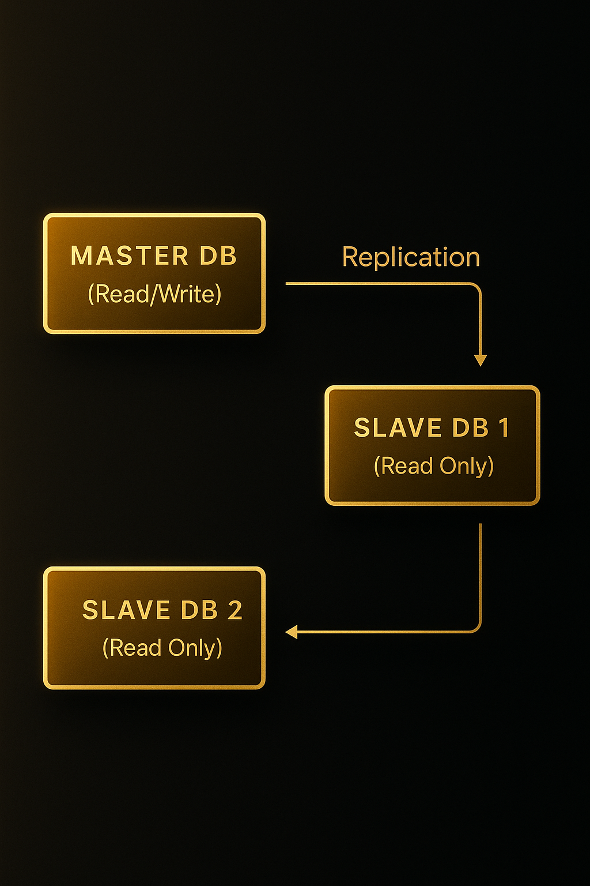

# MySQL Master-Slave Replication on Docker

This project sets up a simple **MySQL replication topology** using Docker. It includes **1 master** and **2 slaves**, where all writes go to the master, and the slaves are **read-only** replicas.

---

## Architecture



---

## Getting Started

Follow these steps to spin up the replication environment:

### 1. Clone this repository

```bash
git clone https://github.com/Rullabcde/master-slave.git
```

### 2. Start the containers

```bash
docker compose up -d
```

This will create containers for the MySQL master and both slave instances.

### 3. Set up replication

```bash
./script/setup-replication
```

This script will configure the slaves to replicate from the master.

### 4. Create a sample database

```bash
./script/create-database
```

This will create a sample database and table on the master node.

### 5. Test the replication

```bash
./script/test-replication
```

This will insert data on the master and verify that it appears on both slave databases.

---
